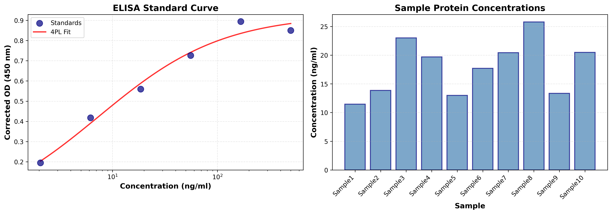

# Immunoassay Data Pipeline

[](https://www.python.org/downloads/)
[](LICENSE)
[](https://pandas.pydata.org/)

A comprehensive bioinformatics pipeline for processing and analyzing immunoassay data (ELISA, ELORA, etc.), including standard curve fitting, concentration calculations, and publication-quality visualizations.

## 🧬 Project Overview

This project demonstrates practical bioinformatics data processing skills by implementing a complete immunoassay analysis workflow. Immunoassays (ELISA, ELORA, etc.) are widely-used laboratory techniques for detecting and quantifying proteins, antibodies, hormones, and other biomolecules in biological samples.

**Context**: This pipeline was developed for a laboratory studying the role of a specific protein in disease pathology (Disease XX). The analysis processes raw optical density (OD) measurements and converts them to protein concentrations using a calibrated standard curve.

## ✨ Features

### Basic Processing (`elisa_processor.py`)
- ✅ Interactive file input for flexible usage
- ✅ Duplicate well averaging (OD1, OD2 → AverageOD)
- ✅ Blank correction (background signal subtraction)
- ✅ Clean CSV output for downstream analysis
- ✅ Comprehensive error handling and user feedback

### Advanced Analysis (`advanced_elisa_analysis.py`)
- 📈 Four-parameter logistic (4PL) regression for standard curves
- 🔬 Automated protein concentration calculations
- 📊 Publication-quality data visualizations
- 📋 Detailed analysis reports
- 🎯 R² goodness-of-fit metrics

## 🚀 Quick Start

### Prerequisites

```bash
# Python 3.8 or higher
python --version

# Install required packages
pip install pandas numpy matplotlib scipy
```

### Basic Usage

```bash
# Run the basic ELISA processor
python elisa_processor.py

# When prompted, enter the path to your data file
Enter the path to the ELISA data CSV file: data/elisa_data.csv
```

### Advanced Analysis

```bash
# Run the advanced analysis with standard curve fitting
python advanced_elisa_analysis.py

# Enter paths when prompted
Enter path to ELISA data CSV: data/elisa_data.csv
Enter path to standard values CSV: data/standard_values.csv
```

## 📁 Project Structure

```
immunoassay-data-pipeline/
│
├── elisa_processor.py              # Basic immunoassay data processing
├── advanced_elisa_analysis.py      # Advanced analysis with curve fitting
├── README.md                       # This file
├── requirements.txt                # Python dependencies
├── LICENSE                         # MIT License
│
├── data/                           # Sample data files
│   ├── elisa_data.csv             # Raw immunoassay measurements
│   └── standard_values.csv        # Standard curve data
│
├── tests/                          # Unit tests
│   └── test_elisa_processor.py    # Test suite
│
└── examples/                       # Example outputs
    ├── elisa_result.csv           # Processed data
    ├── elisa_analysis.png         # Visualization
    └── elisa_report.txt           # Analysis report
```

## 📊 Data Format

### Input: Immunoassay Data (`elisa_data.csv`)

| Sample   | OD1   | OD2   |
|----------|-------|-------|
| Sample1  | 0.443 | 0.488 |
| Sample2  | 0.433 | 0.430 |
| ...      | ...   | ...   |
| BLANK    | 0.110 | 0.135 |

### Input: Standard Values (`standard_values.csv`)

| Samples | OD1   | OD2   | Concentration (ng/ml) |
|---------|-------|-------|-----------------------|
| STD1    | 0.319 | 0.315 | 2.058                 |
| STD2    | 0.618 | 0.463 | 6.173                 |
| ...     | ...   | ...   | ...                   |

### Output: Processed Results (`elisa_result.csv`)

| Sample   | OD1   | OD2   | AverageOD | CorrectedOD | Concentration (ng/ml) |
|----------|-------|-------|-----------|-------------|-----------------------|
| Sample1  | 0.443 | 0.488 | 0.4655    | 0.3430      | 15.23                 |
| Sample2  | 0.433 | 0.430 | 0.4315    | 0.3090      | 12.87                 |
| ...      | ...   | ...   | ...       | ...         | ...                   |

## 🧮 Methodology

### 1. Average OD Calculation

For each sample, the average optical density is calculated from duplicate wells:

```
AverageOD = (OD1 + OD2) / 2
```

### 2. Blank Correction

Background signal (blank) is subtracted from all measurements:

```
CorrectedOD = AverageOD - BlankAverage
```

### 3. Standard Curve Fitting (4PL Model)

The four-parameter logistic model is used for optimal immunoassay curve fitting:

```
OD = D + (A - D) / (1 + (Concentration / C)^B)

Where:
  A = Minimum asymptote (minimum response)
  B = Hill's slope (curve steepness)
  C = Inflection point (EC50)
  D = Maximum asymptote (maximum response)
```

### 4. Concentration Calculation

Sample concentrations are back-calculated from the inverse 4PL function using measured OD values and fitted curve parameters.

## 📈 Example Output

### Standard Curve Visualization


The analysis generates:
- **Left panel**: Standard curve with 4PL fit and R² value
- **Right panel**: Calculated protein concentrations for all samples

### Analysis Report
```
======================================================================
ELISA ANALYSIS REPORT
======================================================================

Blank OD: 0.1225

Standard Curve Parameters (4PL Model):
  A (min asymptote): 0.0824
  B (Hill slope): 1.2156
  C (EC50): 45.3421
  D (max asymptote): 0.9876

Sample Results:
----------------------------------------------------------------------
Sample1: OD = 0.3430, Conc = 15.23 ng/ml
Sample2: OD = 0.3090, Conc = 12.87 ng/ml
...
======================================================================
```

## 🧪 Testing

Run the test suite to verify functionality:

```bash
python -m pytest tests/
```

Tests cover:
- Data loading and validation
- Mathematical calculations
- Edge cases (missing blanks, out-of-range values)
- File I/O operations

## 🎓 Skills Demonstrated

This project showcases key bioinformatics competencies:

- **Data Processing**: Pandas DataFrames, CSV I/O, data cleaning
- **Statistical Analysis**: Regression modeling, curve fitting, R² calculations
- **Scientific Computing**: NumPy arrays, SciPy optimization
- **Visualization**: Matplotlib publication-quality plots
- **Software Engineering**: Modular code, error handling, documentation
- **Domain Knowledge**: Laboratory assay principles, biological data interpretation

## 💡 Real-World Applications

Immunoassays (ELISA, ELORA, etc.) are used extensively in:
- Clinical diagnostics (disease biomarkers, hormone levels)
- Drug development (antibody quantification)
- Research (protein expression studies)
- Quality control (vaccine potency testing)

This pipeline can be adapted for various immunoassay formats and protein targets.

## 🔄 Future Enhancements

- [ ] Support for multi-plate batch processing
- [ ] Alternative curve fitting models (5PL, polynomial)
- [ ] Coefficient of variation (CV) calculations
- [ ] Statistical comparison between sample groups
- [ ] Web-based interactive dashboard
- [ ] Integration with LIMS systems

## 📚 References

1. Findlay, J. W., & Dillard, R. F. (2007). Appropriate calibration curve fitting in ligand binding assays. *AAPS Journal*, 9(2), E260-E267.

2. Motulsky, H. J., & Ransnas, L. A. (1987). Fitting curves to data using nonlinear regression: a practical and nonmathematical review. *The FASEB Journal*, 1(5), 365-374.

3. DeLean, A., Munson, P. J., & Rodbard, D. (1978). Simultaneous analysis of families of sigmoidal curves: application to bioassay, radioligand assay, and physiological dose-response curves. *American Journal of Physiology*, 235(2), E97-E102.

## 👤 Author

**Stephane Karim**
- Biology B.S. Candidate, Brooklyn College (Expected December 2026)
- Software Engineer with Full-Stack & Bioinformatics Experience
- [GitHub](https://github.com/yourusername) | [LinkedIn](https://linkedin.com/in/yourprofile)

## 📄 License

This project is licensed under the MIT License - see the [LICENSE](LICENSE) file for details.

## 🙏 Acknowledgments

- Data provided by [Laboratory Name] studying protein involvement in Disease XX
- Built with Python, Pandas, NumPy, SciPy, and Matplotlib
- Inspired by best practices in computational biology and bioinformatics workflows

---

*For questions, suggestions, or collaboration opportunities, please open an issue or reach out!*
